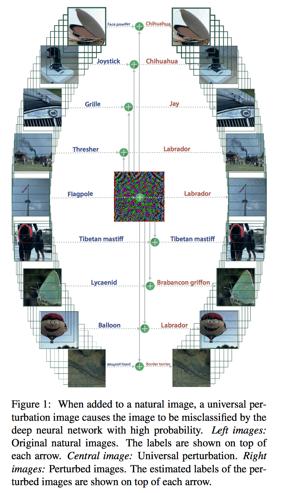
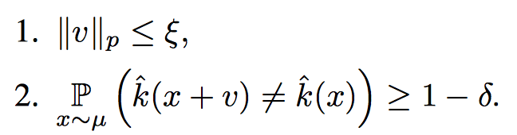
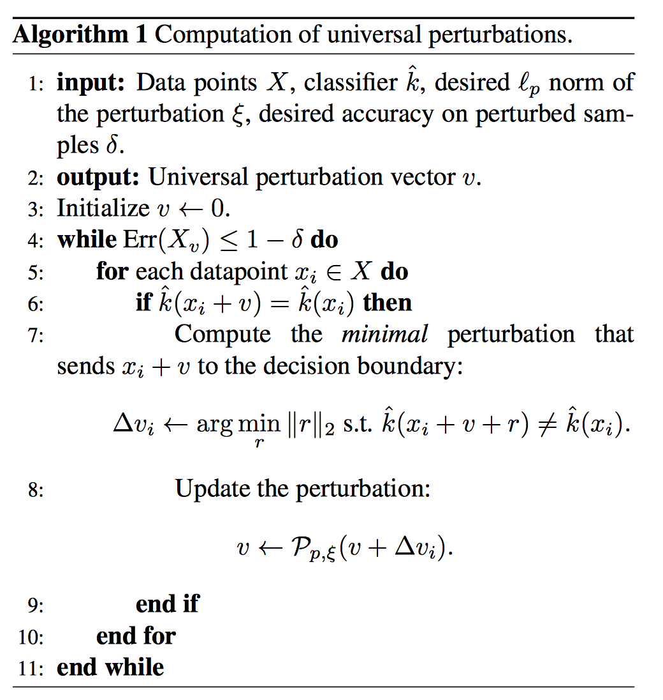
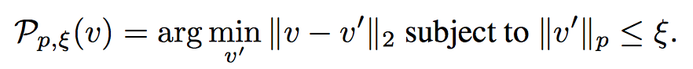
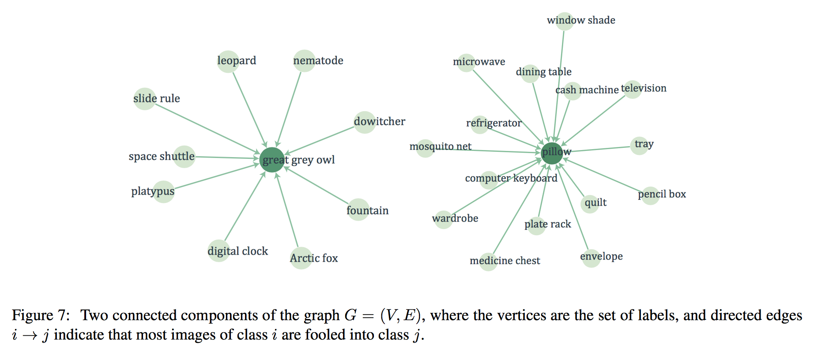
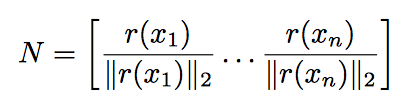
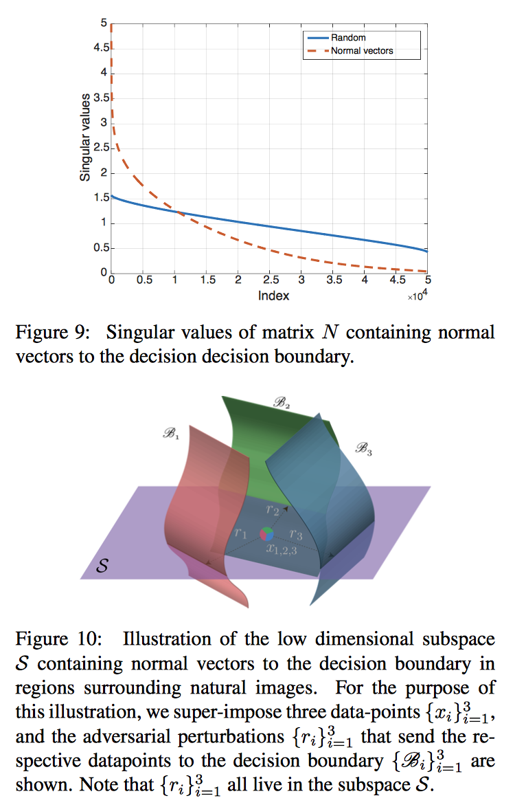

# Universal adversarial perturbations

## overview

2つの意味で universalな `adversarial example` (最初の提案は[goodfellow 2014-12](https://arxiv.org/abs/1412.6572))  の存在を示した。

* data に対して universal
* NN architecture に対して universal (これは前からあったらしい）

## universal adversarial perturbation の見つけかた

1. perturbationの大きさが epsilon以内でかつ
2. fooling rate が (1-delta)以上

のサンプルを発見的に見つける。

dataset中のサンプルを順番に食わせて、foolできなかった時は、
foolできるように r だけずらして(7行目)、epsilon球の中に収まるように射影する(8行目)

ちなみに

## Visualization of the effect of universal perturbations

矢印の意味 = (perturbation前) -> (perturbation後)

dominant なラベルがあるのがわかる。

-> 考察「CNNは input-dimの中で、一部のラベルが大きな体積を占めてそう」

## Explaining the vulnerability to universal perturbations

foolingしやすい摂動方向の行列

がある方向に偏ってる(Fig.9)。（特異値のカーブが急なので）

-> 考察「多様体仮説の一つの根拠」

実際、特異値の大きい方向の固有ベクトルいくつかで構成した部分空間(fig.10のS面)（データの載ってる低次元構造の方向と直行）で、ランダムな方向に perturbation を与えると、完全なランダムperturbationよりもfoolしやすい。（本文最後の方）

